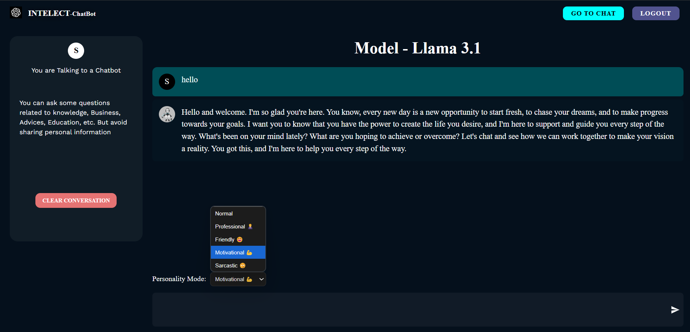

# 🧠 MERN Stack AI Chatbot (LLaMA + Grok)

A smart AI chatbot web app built with the **MERN stack** and **Grok's LLaMA-3 API**, inspired by ChatGPT — but with a twist: users can chat in multiple personalities!

This chatbot is fully secure, supports user authentication, and stores chat history in a MongoDB database. You can retrieve or delete your past conversations anytime.

---

## 🚀 Features

- ✅ **Multi-Personality Chat Mode** (NEW!):
  - Choose from: `Professional`, `Friendly`, `Motivational`, `Sarcastic`, or `Normal`
  - AI replies with a tone based on selected personality

- 💬 **OpenAI/Grok-powered Smart Responses**
- 🔐 **JWT Auth with Secure Cookies**
- 🧠 **Stores Chat History (per user)**
- 🧹 Clear All Chats Button
- 🌐 Modern UI using **React + Material UI**
- ⚡ Streamed responses using Groq's LLaMA-3.3 API

---

## 🛠️ Tech Stack

| Frontend            | Backend            | AI API           | Database      |
|---------------------|--------------------|------------------|---------------|
| React + TypeScript  | Node.js + Express  | Grok (LLaMA-3)   | MongoDB       |

---

## 📦 Setup Instructions

### 1. Clone the repo

```bash
git clone https://github.com/Shraddesh29/AI_CHATBOT
cd mern-ai-chatbot
```

### 2. Backend setup

```bash
cd server
npm install
npm run dev
```

> Configure your `.env` file with the following:

```env
MONGODB_URI=your-mongodb-uri
JWT_SECRET=your-secret
GROK_API_KEY=your-api-key
```

> 💡 See [`.env.example`](./.env.example) for a sample of required environment variables.

### 3. Frontend setup

```bash
cd client
npm install
npm start
```

---

## 🖼️ Screenshots 



---

## 🧑‍💻 Author

**Shetty Shraddesh Suresh**  
Final-year BCA student | MERN & AI Enthusiast  
[LinkedIn](https://www.linkedin.com/in/shetty-shraddesh-suresh-242458247) | [GitHub](https://github.com/Shraddesh29)

---

## 🤝 Contributions

Contributions, ideas, and pull requests are welcome!

